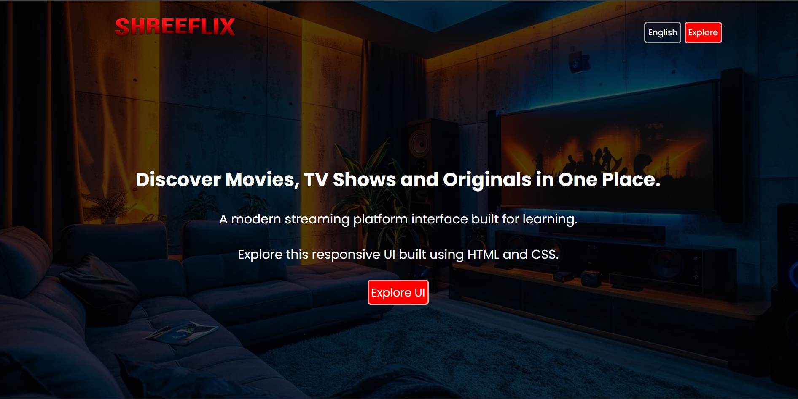

# 🎬 ShreeFlix

A movie-focused web interface built with **HTML and CSS**, designed to provide a clean and engaging streaming-style user interface.

## ✨ Features

* 🎬 Movie-focused interface
* 🎨 Modern streaming-style design
* 📱 Responsive layout
* 🖼️ Movie artwork and visual content
* 🎥 Video content section
* ⚡ Built with pure HTML and CSS

## 🛠️ Technologies Used

* HTML5
* CSS3

## 📁 Project Structure

ShreeFlix/
├── photo/        # Images and movie artwork
├── videos/       # Video content
├── index.html    # Main webpage
├── style.css     # Website styling
└── README.md     # Project documentation

## 📸 Preview

## 🌐 Live Demo

[🎬 ShreeFlix Live Demo](https://cinehubui.netlify.app/)

## 📚 What I Learned

Through this project, I practiced:

* Creating webpages with semantic HTML
* Styling layouts with CSS
* Building a streaming-style user interface
* Working with images and video content
* Creating responsive web layouts

## 👨‍💻 Author

**Shreedhara**

GitHub: [@shreedhara091](https://github.com/shreedhara091)

